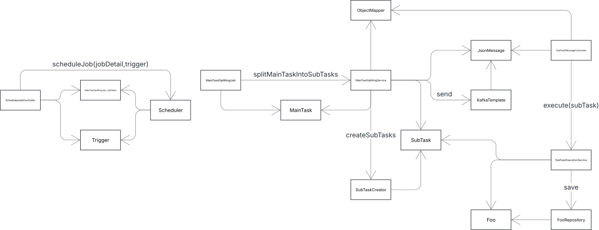

### Getting Started

You can run H2 and Kafka prior to running the app via `docker-compose up` command. Afterwards you can run the app. 
When the bootstrap is complete, you can submit a new job via following command
`curl -X POST -H 'Content-Type: application/json' -d '{"start":1,"end":999}'  http://localhost:8080/scheduler/jobs`
The job will be run by the quartz within the next second only once, and you should be able to see create Foo records 
in the H2 database by accessing browser console http://localhost:8082 and connecting to the DB with URL
`jdbc:h2:tcp://localhost/h2-data/test`. The Kafka messages can be examined via http://localhost:9000.

### References

* http://www.quartz-scheduler.org/documentation/quartz-2.3.0/configuration/ConfigJDBCJobStoreClustering.html
* https://medium.com/javarevisited/how-to-cluster-effectively-quartz-jobs-9b097f5e1191
* https://lucid.app/lucidchart/52fb9a48-6cae-4bdb-83ea-b07f88e81b82/edit?viewport_loc=29%2C436%2C1046%2C547%2CHWEp-vi-RSFO&invitationId=inv_97a1c482-c3c7-4799-afb6-7d1fc99a5fa8
